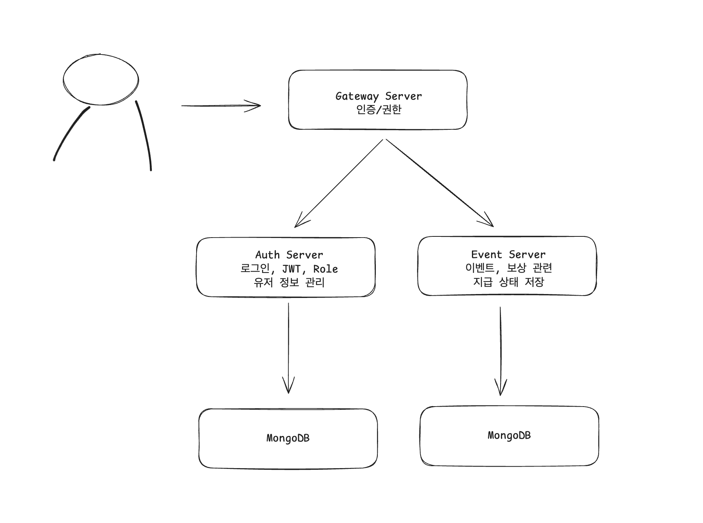

# 🔧 설계 구조 (Initial Architecture Draft)

서비스의 구성 요소를 구상할 때 요구사항에 따라 다음과 같은 구조로 시각화하면서 출발했습니다:



> 각 서버의 책임을 분리하고 Gateway를 진입점으로 설정한 기본적인 MSA 형태입니다.


## 📁 프로젝트 디렉토리 구조

상세 디렉토리 구조는 다음과 같습니다.

---

### 1. Auth Server (`apps/auth`)

Auth Server는 사용자 계정 관리 및 인증 토큰 발급을 전담합니다.

*   주요 기능: 사용자 등록, 로그인, 역할 관리, JWT 발급 및 검증 (내부용)

```text
apps/
└── auth/
    ├── src/
    │   ├── application/                               // 애플리케이션 서비스 및 유스케이스
    │   │   └── use-cases/                                 // 시스템의 주요 기능 단위 (예: 회원가입, 로그인)
    │   │       ├── login-user/                                // 로그인
    │   │       │   ├── login-user.usecase.ts                      // 로그인 유즈케이스
    │   │       │   ├── login-user.usecase.spec.ts                 // 유즈케이스 단위 테스트
    │   │       │   └── login-user.input.ts                        // 유스케이스 내부 입력 인터페이스 정의
    │   │       │   └── login-user.output.ts                       // 유스케이스 내부에서 나가는 인터페이스 정의
    │   │       └── register-user/                             // 회원 가입
    │   │           ├── register-user.usecase.ts 
    │   │           ├── register-user.usecase.spec.ts
    │   │           └── register-user.input.ts                     
    │   │   
    │   │   
    │   ├── domain/                                    // 핵심 비즈니스 로직 및 도메인 모델
    │   │   ├── entities/                                  // 도메인 엔티티 (내부 생략)
    │   │   ├── errors/                                    // 해당 도메인의 에러 정의 (내부 생략)
    │   │   ├── ports/                                 // 도메인 내부 인터페이스 모음 (DIP)
    │   │   │   └── user.repository.ts                     // 영속 계층 접근 인터페이스
    │   │   │   └── hasing.port.ts                         // 암호화를 위한 인터페이스
    │   │   │   └── token-generator.port.ts                // 토큰 생성 인터페이스
    │   │   └── value-objects/                         // 도메인 내부 순수 값 객체 (내부 생략)
    │   │ 
    │   │   
    │   ├── infrastructure/                            // 외부 시스템 연동 및 실제 구현체    
    │   │   ├── hashing/                                   // 비밀번호 해싱
    │   │   │   └── argon2.service.ts
    │   │   ├── jwt/                                   // JWT (nestjs/jwt)
    │   │   │   └── jwt.service.ts
    │   │   └── persistence/                           // DB (영속 계층)
    │   │       └── user-mongo.repository.ts               // MongoDB 기반 User 리포지토리 구현체 (다른 영속 계층이 있다면 디렉토리 분류)
    │   │ 
    │   │ 
    │   ├── presentation/                              // 외부 연동 인터페이스 (API 컨트롤러, DTO 등)
    │   │   ├── controllers/                               // HTTP 요청 처리 컨트롤러 (내부 생략)
    │   │   └── dtos/                                      // DTO (내부/설명 생략)
    │   │       ├── request/
    │   │       └── response/
    │   │ 
    │   │ 
    │   ├── auth.module.ts 
    │   └── main.ts
    │   │ 
    │   │ 
    └── test/
        └── auth.e2e-spec.ts
```

---

### 2. Gateway Server (`apps/gateway`)

API Gateway는 모든 클라이언트 요청의 단일 진입점(Single Entry Point) 역할을 수행합니다. 주요 책임은 다음과 같습니다:

*   인증 및 권한 부여: JWT 토큰 검증 및 역할 기반 접근 제어
*   요청 라우팅: 수신된 요청을 적절한 내부 마이크로서비스(`Auth`, `Events`)로 전달


```text
apps/
└── gateway/
    ├── src/
    │   ├── auth                        // 게이트웨이 인증 관련 (내부/설명 생략)
    │   |   ├── decorators
    │   |   ├── guards                  
    │   |   └── strategy                   
    │   |
    │   |
    │   ├── config/                     // 게이트웨이 설정
    │   |   └── gateway-proxy.config.ts     // 프록시 대상 경로 설정
    │   │
    │   │
    │   ├── proxy/                      // 백엔드 서비스로의 요청 프록시 및 라우팅
    │   │   ├── controllers/                // 서비스 그룹별 프록시 컨트롤러 (내부 생략)
    │   │   └── services/                   // 실제 HTTP 요청 포워딩 및 응답 처리 로직 (내부 생략)
    │   │   └── proxy.module.ts
    │   │ 
    │   │ 
    │   ├── shared/                    // 게이트웨이 전역에 사용되는 코드
    │   |   ├── constnats/                 
    │   |   |   └── headers.constants.ts       // 프록시로 전해질 커스텀 헤더 상수
    │   |   └── errors
    │   | 
    │   | 
    │   ├── app.module.ts
    │   └── main.ts 
    │
    │
    └── test/
        └── gateway.e2e-spec.ts
```
