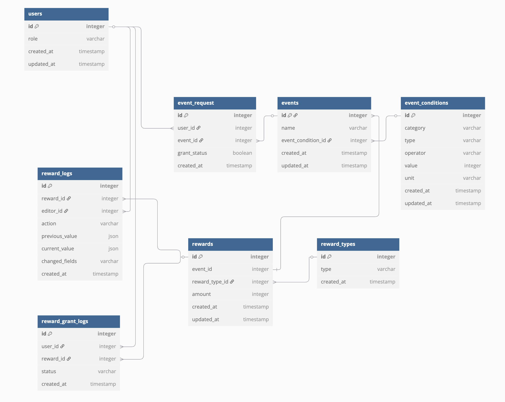

# 🗂 초기 ERD 설계 (Initial Entity Relationship Diagram)

> 이벤트/보상 관리 시스템의 초안 ERD입니다.  
> MongoDB 기반 구조지만 정규화된 형태로 설계해 확장성과 명확성을 우선했습니다.

---

> 설계 및 렌더링은 [dbdiagram.io](https://dbdiagram.io) 를 사용했습니다.

---

## 📌 주요 테이블 설명

| 테이블 | 설명 |
|--------|------|
| `users` | 사용자 기본 정보 및 역할 |
| `events` | 이벤트 정보, 조건과 연결됨 |
| `event_conditions` | 조건 구성: category/type/operator/value/unit |
| `event_request` | 유저의 이벤트 참여 요청 (중복 방지) |
| `rewards` | 이벤트별 보상 정보 |
| `reward_types` | 보상 종류: 포인트, 아이템, 쿠폰 등 |
| `reward_logs` | 보상 정보 변경 기록 |
| `reward_grant_logs` | 보상 지급 시도/이력/상태 기록 |